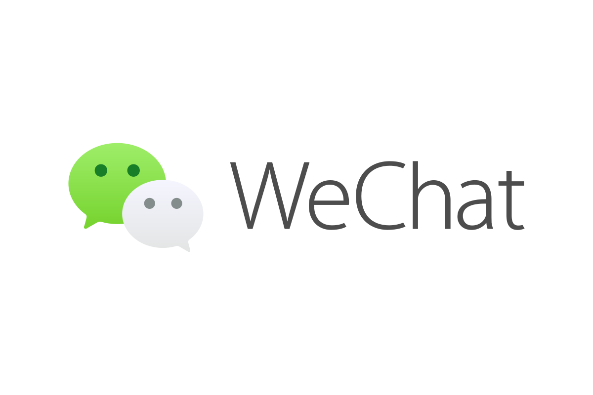

<h1 align="center">
    
</h1>

<h4 align="center">
  🚀 Online Chat
</h4>

  <a href="#-technologies">Technologies</a>&nbsp;&nbsp;&nbsp;|&nbsp;&nbsp;&nbsp;
  <a href="#-project">Project</a>&nbsp;&nbsp;&nbsp;|&nbsp;&nbsp;&nbsp;
  <a href="#memo-license">License</a>

 

## 🚀 Technologies

This project was developed with the following technologies:

- [Node.js](https://nodejs.org/en/)
- [React](https://reactjs.org)
- [Socket.IO](https://socket.io/)

## 💻 Project

The Final Assigment aims consists a chat that people can use to communicate with each other.

## :memo: License

This project is unde the MIT license. Open [LICENSE](LICENSE.md) archive to get more info

---

Done with ♥ by edunt3r :wave:
